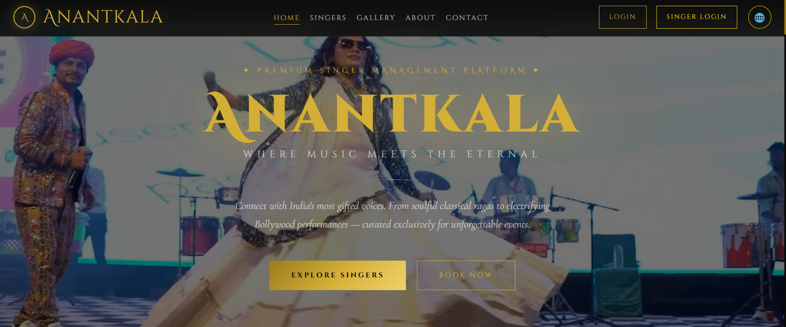
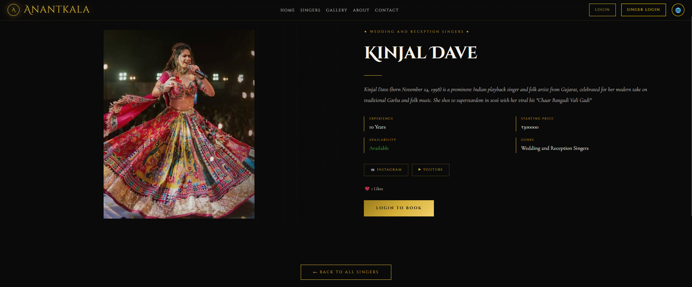
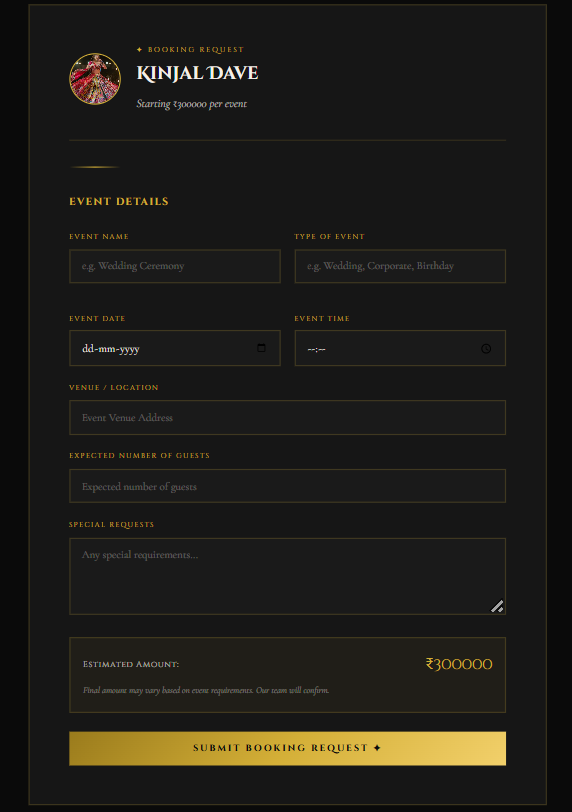
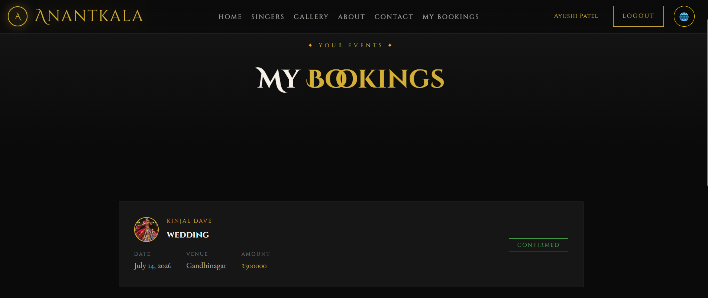
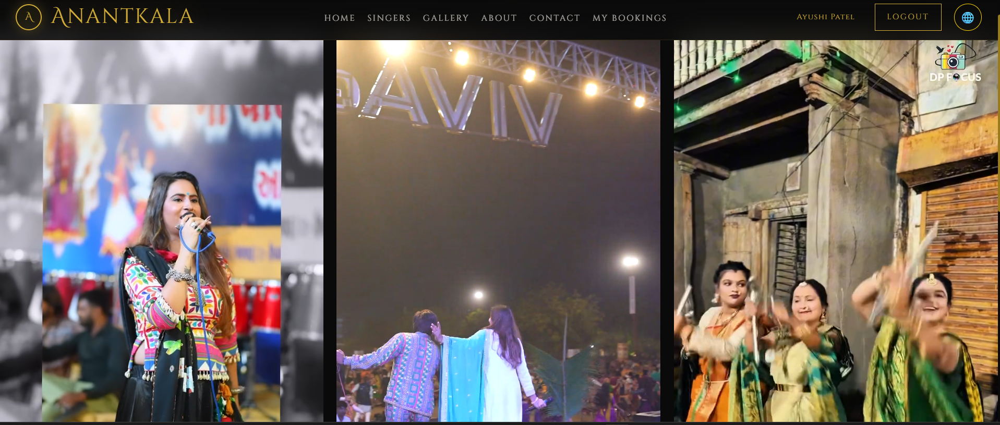
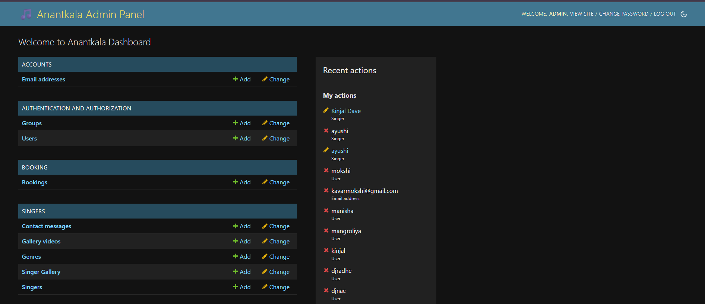

# 🎤 ANANTKALA – Premium Singer Booking & Management Platform


---

# 📖 About the Project

**ANANTKALA** is a premium **Singer Booking & Management Platform** developed using **Django** during my internship for a **real client project**.

The platform enables users to discover talented singers, send booking requests, and manage bookings through a secure and responsive web application. Administrators can approve singers, manage bookings, manage gallery content, and control the complete platform through an intuitive admin dashboard.

---

# ✨ Features

- 🎤 Singer Registration & Approval System
- 📅 Online Singer Booking
- 👤 Secure User Authentication
- 🔐 Google OAuth Login
- 🛠️ Admin Dashboard
- 🖼️ Dynamic Gallery Management
- 🌍 Multi-language Support (English & Gujarati)
- 📱 Fully Responsive Design
- 📩 Contact & Inquiry System
- 📆 Booking Management
- 🎵 Singer Profile Management

---

# 🛠 Tech Stack

### Frontend

- HTML5
- CSS3
- Bootstrap 5
- JavaScript

### Backend

- Python
- Django

### Database

- SQLite

### Authentication

- Django Authentication
- Google OAuth

---

# 📂 Project Structure

```text
anantkala/
│── booking/
│── media/
│── screenshots/
│── singers/
│── static/
│── templates/
│── manage.py
│── settings.py
│── urls.py
│── requirements.txt
```

---

# 📸 Project Screenshots

## 🏠 Home Page



---

## 🎤 Singer Listing



---

## 📅 Booking Page



---

## 🎟️ My Bookings



---

## 🖼️ Gallery



---

## 📞 Contact Us


---

## ⚙️ Admin Dashboard



---

# 🚀 Installation

```bash
git clone https://github.com/Ayushi9350/Anantkala-Singer-Booking-Platform.git

cd Anantkala-Singer-Booking-Platform

pip install -r requirements.txt

python manage.py migrate

python manage.py runserver
```

---

# 💡 Future Enhancements

- 💳 Online Payment Gateway
- 📧 Email Notifications
- 📅 Calendar Booking
- 🔍 Advanced Search & Filters
- ⭐ User Reviews & Ratings
- 🤖 AI-Based Singer Recommendation

---

# 👩‍💻 Developed By

**Ayushi Mangroliya**

- Computer Engineering Student
- Python & Django Developer
- AI/ML Enthusiast

---

# ⭐ Support

If you found this project useful, don't forget to ⭐ **Star this repository**.
